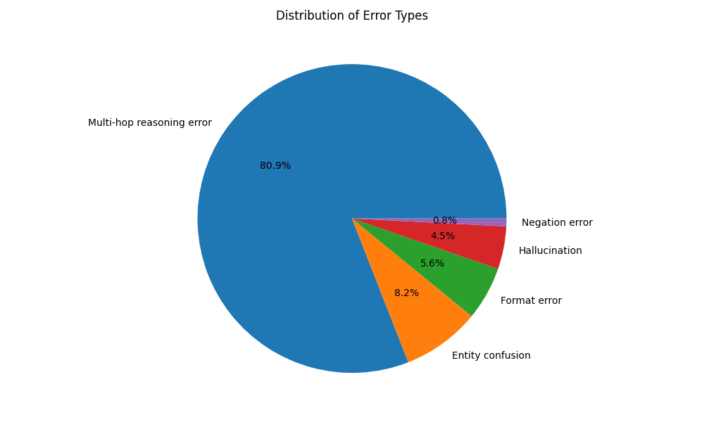
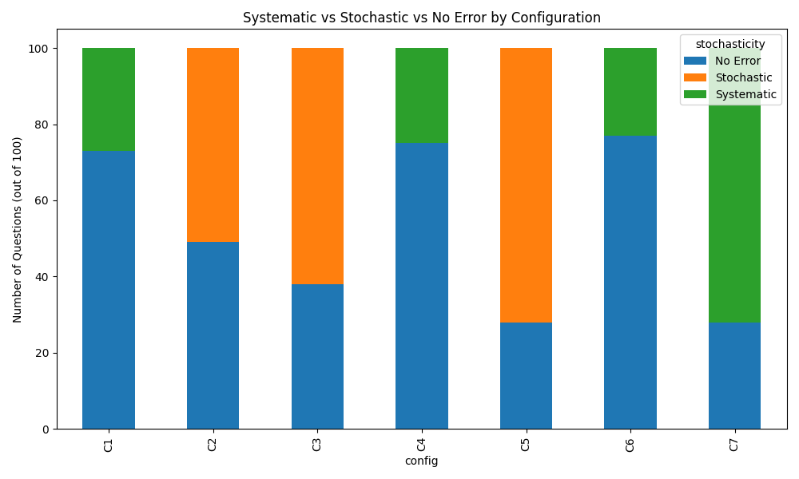

<!--
Deck w Marp. Podgląd/eksport w VS Code: zainstaluj rozszęrzenie "Marp for VS Code",
otwórz ten plik, ikona podglądu → "Export slide deck..." (PDF / PPTX / HTML).
Notatki w komentarzach <!-- --> pojawiają się w trybie prezentera.
Slajd 7 (kappa): wpisz liczbę po uruchomieniu 07_calculate_kappa.py.
-->

# Gdzie poddaje się model 8B?
## Analiza błędów Llama 3.1 w multi-hop QA

**Llama 3.1 8B · HotpotQA · 7 konfiguracji · sędzia Gemma 2 9B**

<br>

<!--
Hook (20 s): Sprawdziliśmy nie ILE razy model się myli, ale JAK się myli
— i czy da się to naprawić.
-->

---

# Problem i metodologia

**Pytania multi-hop** — odpowiedź wymaga *dwóch skoków*
np. reżyser filmu → jego miejsce urodzenia

```
100 zamrożonych pytań → 7 konfiguracji → 3400 odpowiedzi → 3 metryki + sędzia AI
```
*(C2/C3/C5 po 10 iteracji → stąd 3400, nie 700)*

- **Zbiór:** HotpotQA (`distractor`), 100 pytań zbalansowanych (25× bridge/comparison × easy/hard), zamrożony raz
- **Model:** Llama 3.1 8B lokalnie (Ollama)
- **7 konfiguracji:** temperatura (0 / 0.5 / 1.0) × prompt (standard / CoT / expert) × agent z Wikipedią

<!--
60 s: wyjaśnij multi-hop na jednym przykładzie; "zamrożony zbiór = uczciwe
porównania, te same pytania w każdej konfiguracji"; 3 osie zmian.
-->

---

# Kryzys klasycznych metryk


- **Exact Match = 0%** we *wszystkich* 7 konfiguracjach
- **F1 = 3–17%**
- **Sędzia AI (Gemma 2 9B) = 69–77%** (konfiguracje kontekstowe)

**Llama „rozlewa" odpowiedź w całe zdania** — gold: *„Elizabeth Taylor"*, model: *„Dame Elizabeth Rosemond Taylor was a British-American actress…"*

<!--
90 s: EM/F1 karzą poprawny fakt jako 0, bo forma się nie zgadza. Sędzia-LLM
wyciąga sedno. WNIOSEK: miary n-gramowe są bezużyteczne do oceny wnioskowania LLM.
Ale uwaga — to nie znaczy, że model jest świetny (patrz dalej).
-->

---

# Typologia błędów



Spośród błędnych odpowiedzi (sędzia = 0):

- **Multi-hop reasoning — 80.9%**
- Entity confusion — 8.2%
- Format error — 5.6%
- Halucynacja — 4.5%
- Negacja — 0.8%

<!--
60 s: W 4 na 5 przypadków to ZAŁAMANIE DRUGIEGO SKOKU — model znajduje pierwszy
fakt, ale nie łączy z drugim. Halucynacje RZADKIE (4.5%) — model raczej "nie umie
połączyć" niż "zmyśla". Kontruje obraz LLM jako głównie halucynujących.
-->

---

# Błędy systematyczne vs stochastyczne



- **temp 0** (C1, C4, C6) → błędy **systematyczne** (0 stochastycznych — determinizm)
- **temp 0.5–1.0** (C2, C3, C5) → błędy **stochastyczne** rosną z temperaturą
  - C3 (temp 1.0): **62/100** błędów stochastycznych

**Recepta:** *self-consistency* — zapytaj 10×, weź większość. Naprawia stochastyczne, **nie** systematyczne.

<!--
75 s: przy wyższej temperaturze błąd "migocze" — raz trafia, raz nie → wiedza
TAM JEST, tylko niestabilna. To teza całości: różne ustawienia zmieniają nie
tyle ILE, co JAK (i czy naprawialnie) model się myli.
-->

---

# Paradoks RAG: agent z Wikipedią wypada GORZEJ


- C7 (agent + wyszukiwanie Wikipedii): **~28%** sędziego
- vs **69–77%** przy kontekście w prompcie
- Błędy C7 są **systematyczne** (72/100) — powtarzalnie złe trajektorie

**Dla modeli 8B „podaj kontekst" bije „pozwól szukać".**

<!--
60 s: kontrintuicyjne — daliśmy narzędzie do szukania i było GORZEJ. Model 8B
gubi się w pętli ReAct: kiepskie zapytania, błądzenie w 3 krokach. Mocny punkt
na pytania z sali.
-->

---

# Wpływ promptu

| Konfiguracja | Sędzia |
|---|:-:|
| C6 — expert (temp 0) | **0.77** (najlepszy) |
| C4 — CoT (temp 0) | 0.75 |
| C1 — standard (temp 0) | 0.73 |
| C3 — standard (temp 1.0) | 0.69 (najgorszy kontekstowy) |

CoT / expert dają **+2–4 pkt** — nie rewolucję. CoT **zmienia profil błędów**: F1 leci do ~3%, bo model jeszcze bardziej „leje wodę".

<!--
45 s: prompt engineering pomaga marginalnie; ważniejsze że zmienia KSZTAŁT
błędów, nie tylko liczbę. Wysoka temperatura lekko szkodzi.
(Slajd opcjonalny — przy braku czasu scal ze slajdem "Kryzys metryk".)
-->

---

# Walidacja ludzka: Cohen's kappa

- **Surowa zgodność człowiek ↔ Gemma: 74%**
- **Cohen's kappa = 0.256** · **Gwet's AC1 = 0.715** (znaczna)

100 błędów sklasyfikowanych **niezależnie przez człowieka** vs ukryta ocena Gemmy

**Czemu κ ≪ AC1? Paradoks kappy.** Rozkład skrajnie skośny (76–84% multi-hop) → zgodność losowa wysoka, co zaniża κ. AC1 (odporny na ten efekt, Gwet 2008) pokazuje rzeczywistą zgodność jako **znaczną**.

**Reszta niezgodności = realny finding:** człowiek wyłapał **15 błędów formatu** (model odpowiedział *dobrze, ale rozwlekle*), które Gemma wrzuciła do multi-hop → sędzia AI **myli formę z poprawnością**, jak EM. Stąd potrzeba nadzoru człowieka.

<!--
45 s: NIE chowamy kappy — raportujemy κ=0.256 ORAZ AC1=0.715, uczciwie obok
siebie, i wyjaśniamy różnicę paradoksem kappy (skośny rozkład 76-84% multi-hop
zawyża zgodność losową i zaniża κ). AC1 to standardowa, paradoks-odporna miara
(Gwet 2008) → realna zgodność jest ZNACZNA. Druga część niezgodności to finding:
człowiek wyłapuje format tam, gdzie AI widzi multi-hop → AI klasyfikator
dziedziczy ślepotę EM (forma ≠ poprawność). Zrzut z 07_calculate_kappa.py obok.
-->

---

# Wnioski

1. **Miary n-gramowe (EM/F1) są martwe** dla oceny LLM — liczy się sędzia semantyczny
2. **Bariera modeli 8B to drugi skok rozumowania** (80.9% błędów), nie halucynacje
3. **RAG bez silnego modelu szkodzi**; self-consistency naprawia błędy stochastyczne, nie systematyczne

**Ograniczenia:** 100 pytań (25/komórkę) · jeden anotator · sędzia 9B (stąd kappa) · możliwa kontaminacja HotpotQA

**Future work:** silniejszy sędzia (GPT-4o/Gemini) · self-consistency produkcyjnie · lepszy scaffolding agenta

<!--
45 s: zamknij tezą ze slajdu sys/stoch — nie ILE, a JAK się myli. Dziękujemy, pytania.
-->

---

<!-- _paginate: false -->

# Dziękujemy — pytania?

Slajdy backup za tym slajdem ↓

---

# BACKUP — Pełna tabela metryk (7×3)

| Konfiguracja | EM | F1 | Judge |
|---|:-:|:-:|:-:|
| C1 — std, temp 0 | 0% | 16.7% | 73.0% |
| C2 — std, temp 0.5 (×10) | 0% | 17.1% | 73.5% |
| C3 — std, temp 1.0 (×10) | 0% | 15.1% | 69.1% |
| C4 — CoT, temp 0 | 0% | 3.5% | 75.0% |
| C5 — CoT, temp 0.5 (×10) | 0% | 3.3% | 74.0% |
| C6 — expert, temp 0 | 0% | 5.7% | **77.0%** |
| C7 — agent + Wikipedia | 0% | 4.0% | **28.0%** |

*F1 spada przy CoT/expert (C4–C6), bo dłuższe „rozumowanie" rozcieńcza pokrycie tokenów.*

---

# BACKUP — Taksonomia 5 kategorii błędów

1. **Halucynacja** — informacja całkowicie zmyślona, nieobecna w tekście (lub urojone komendy systemowe)
2. **Multi-hop reasoning** — pierwszy skok OK, drugi krok zawodzi (połączenie faktów)
3. **Format** — zna fakt, ale zła forma (akapit „lania wody" zamiast krótkiej frazy)
4. **Negacja** — przeoczył lub odwrócił negację w tekście
5. **Entity confusion** — wybrał powiązaną, ale złą encję (np. aktor drugoplanowy z tego samego filmu)

*Rozkład: multi-hop 80.9% · entity 8.2% · format 5.6% · halucynacja 4.5% · negacja 0.8%*

---

# BACKUP — Przykład: czysty multi-hop failure

**Pytanie:** *Charles Libby graduated from a high school located at what address?*
**Złota odpowiedź:** `284 Cumberland Avenue`
**Model (C1, temp 0):** *„There is no information… However, he graduated from **Portland High School** in Maine."*

**Kluczowe fakty (HotpotQA):**
- ① *Libby graduated from **Portland High School**…* ✅ model to znalazł
- ② *Portland High School **is located at 284 Cumberland Avenue**…* ❌ model nie połączył

→ Pierwszy skok wykonany, drugi nie. Model nawet **przyznaje**, że „nie ma informacji" — choć była w tekście.

---

# BACKUP — Systematyczne vs stochastyczne (liczby, n=100)

| Konfiguracja | Bez błędu | Stochastyczne | Systematyczne |
|---|:-:|:-:|:-:|
| C1 — temp 0 | 73 | 0 | 27 |
| C2 — temp 0.5 | 49 | **51** | 0 |
| C3 — temp 1.0 | 38 | **62** | 0 |
| C4 — CoT temp 0 | 75 | 0 | 25 |
| C5 — CoT temp 0.5 | 28 | **72** | 0 |
| C6 — expert temp 0 | 77 | 0 | 23 |
| C7 — agent | 28 | 0 | **72** |

*temp 0 → wyłącznie systematyczne (determinizm). temp>0 → stochastyczne rosną z temperaturą.*

---

# BACKUP — Sanity-check: dlaczego EM = 0%

- **EM = 0 dla wszystkich 3400 odpowiedzi** — realny efekt, nie bug
- **Mediana odpowiedzi modelu: 39 słów** vs **mediana golda: 2 słowa** (~20× za długo)
- **Złota odpowiedź dosłownie zawarta w 68.2%** odpowiedzi → fakt zwykle JEST, metryka go gubi
- **„Zawiera gold" 68.2% ≈ Judge 71.1%** → niezależny, nie-LLM-owy sygnał potwierdza sędziego

**Przykład (C1):** gold `Elizabeth Rosemond Taylor`, model: *„Elizabeth Taylor was a British-American actress…"* — merytorycznie **dobrze**, EM = 0.

→ EM/F1 mierzą formę, nie wiedzę. Stąd konieczność sędziego semantycznego.
